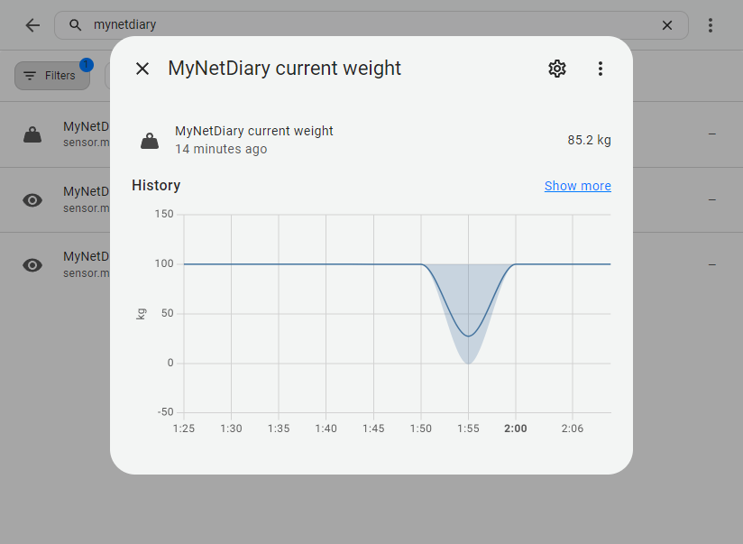
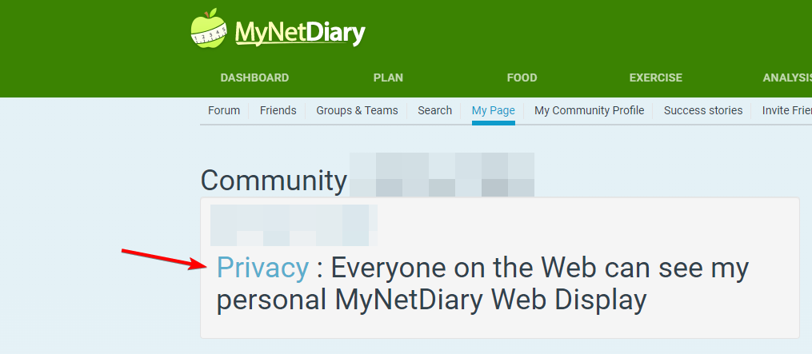
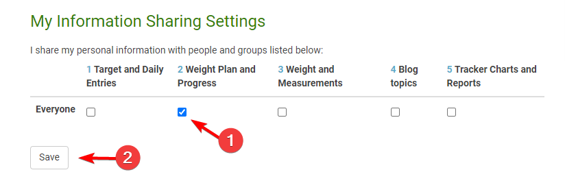
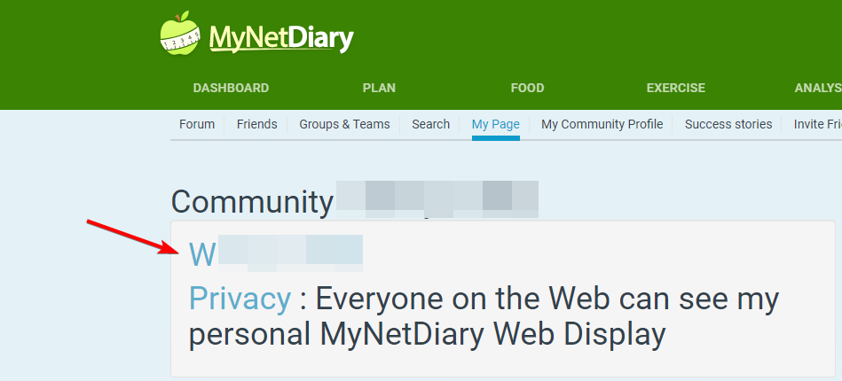

# Example Sensor

A Home Assistant integration for MyNetDiary.



#### How it works
MyNetDiary allows you to expose your personal data to the public (you can choose what data to show)

And This custom components grabs these data :)

---

### Configure MyNetDiary

1. Login into your account

2. Navigate to: `https://www.mynetdiary.com/person.do`

3. Under `My Page` table, click the `Privacy`



4. Set `My Information Sharing Settings` to `2 Weight Plan and Progress` and click save



5. Go back to `My Page` and copy your community link (right click -> copy link address)



---

### Configure Home Assistant Component

1. Copy the folder `mynetdiary` from custom_components directory to `<config_dir>/custom_components/`.

    Example `<config_dir>/custom_components/mynetdiary`

2. Open `<config_dir>/custom_components/mynetdiary/sensor.py` and change `MyNetDiary_URL` variable to your community link
3. Restart Home Assistant
4. Add the following to your `configuration.yaml` file:

```yaml
# Example configuration.yaml entry
sensor:
  - platform: mynetdiary
```
5. Restart Home Assistant
6. Open Settings -> Devices & Services -> Entities -> Search for `mynetdiary`

---

### Testing

1. You can test the script by running `test_script.py`

Example of result

```text
current_weight: 100.2
start_weight: 100.2kg on 15.04.24
lost_so_far: none
```